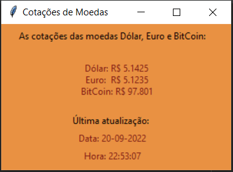

# Cotações de Moedas com Tkinter

Neste projeto se utiliza de forma simples uma API do site 
[AwesomeAPI](https://docs.awesomeapi.com.br/api-de-moedas)
para coletar as cotações atuais do dólar, do euro e do bitcoin
e utiliza-se a biblioteca tkinter para exibir os valores em
uma interface gráfica.

  

Trata-se de um projeto simples para aprendizado quanto ao
funcionamento da API mencionada.

#### Estrutura do projeto:
    -> quotations.py
    -> README.md
    -> images (folder)

Créditos da ideia do projeto: 

[Hashtag Programação](https://www.youtube.com/watch?v=AiBC01p58oI&t=103s&ab_channel=HashtagPrograma%C3%A7%C3%A3o)

------------------------------
Contato:
-
[LinkedIn](https://www.linkedin.com/in/rodolpho-kades/)

[GitHub](https://github.com/rodskades)

<rodolpho_kades@hotmail.com>
